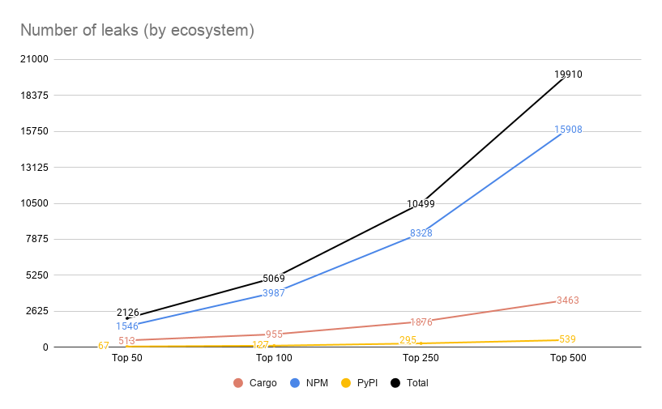
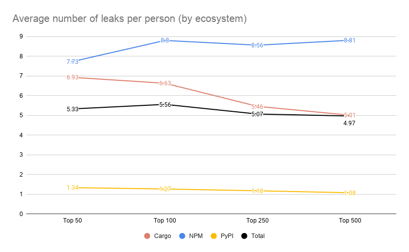
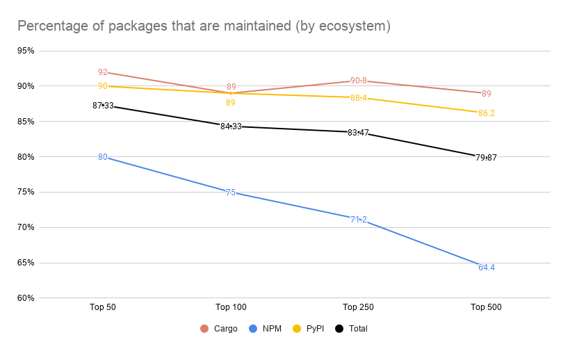
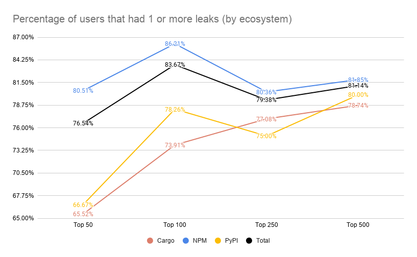

# Finding Attack Vectors in the Most Depended On Packages

## Leaks

|                                | Top 50 | Top 100 | Top 250 | Top 500 |
|--------------------------------|--------|---------|---------|---------|
| Cargo leaks                    | 513    | 955     | 1876    | 3463    |
| NPM leaks                      | 1546   | 3987    | 8328    | 15908   |
| PyPI leaks                     | 67     | 127     | 295     | 539     |
| **Total leaks**                | 2126   | 5069    | 10499   | 19910   |
|                                |        |         |         |         |
| Cargo avg leaks/person         | 6.93   | 6.63    | 5.46    | 5.01    |
| NPM avg leaks/person           | 7.73   | 8.8     | 8.56    | 8.81    |
| PyPI avg leaks/person          | 1.34   | 1.27    | 1.18    | 1.08    |
| **Total avg leaks/person**     | 5.33   | 5.56    | 5.07    | 4.97    |

## Maintenance

|                                | Top 50 | Top 100 | Top 250 | Top 500 |
|--------------------------------|--------|---------|---------|---------|
| Cargo maintained package %     | 92.00  | 89.00   | 90.80   | 89.00   |
| NPM maintained package %       | 80.00  | 75.00   | 71.20   | 64.40   |
| PyPI maintained package %      | 90.00  | 89.00   | 88.40   | 86.20   |
| **Total maintained package %** | 87.33  | 84.33   | 83.47   | 79.87   |

## Users

|                               | Top 50 | Top 100 | Top 250 | Top 500 |
|-------------------------------|--------|---------|---------|---------|
| Cargo users with >0 leaks     | 19     | 34      | 74      | 137     |
| Cargo users                   | 29     | 46      | 96      | 174     |
|                               |        |         |         |         |
| NPM users with >0 leaks       | 95     | 200     | 360     | 609     |
| NPM users                     | 118    | 232     | 448     | 744     |
|                               |        |         |         |         |
| PyPI users with >0 leaks      | 10     | 18      | 30      | 52      |
| PyPI users                    | 15     | 23      | 40      | 65      |
|                               |        |         |         |         |
| **Total users with >0 leaks** | 124    | 251     | 462     | 796     |
| **Total users**               | 162    | 300     | 582     | 981     |

## Emails

(This only includes emails that had > 0 leaks)

|                                | Top 50 | Top 100 | Top 250 | Top 500 |
|--------------------------------|--------|---------|---------|---------|
| Cargo Gmail emails             | 10     | 16      | 41      | 66      |
| NPM Gmail emails               | 52     | 108     | 200     | 349     |
| PyPI Gmail emails              | 2      | 4       | 8       | 20      |
| **Total Gmail emails**         | 64     | 127     | 247     | 433     |
|                                |        |         |         |         |
| Cargo .edu emails              | 1      | 1       | 1       | 3       |
| NPM .edu emails                | 2      | 3       | 4       | 5       |
| PyPI .edu emails               | 0      | 0       | 0       | 0       |
| **Total .edu emails**          | 3      | 4       | 5       | 8       |
|                                |        |         |         |         |
| Cargo .gov emails              | 0      | 0       | 0       | 0       |
| NPM .gov emails                | 0      | 0       | 0       | 0       |
| PyPI .gov emails               | 0      | 0       | 0       | 0       |
| **Total .gov emails**          | 0      | 0       | 0       | 0       |
|                                |        |         |         |         |
| Cargo other emails             | 8      | 17      | 32      | 68      |
| NPM other emails               | 41     | 89      | 156     | 255     |
| PyPI other emails              | 8      | 14      | 22      | 32      |
| **Total other emails**         | 57     | 120     | 210     | 355     |
